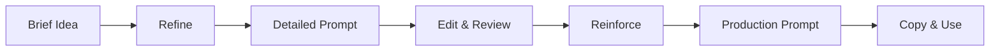

# Promptpad ✨

> **Production Ready** – Local-first prompt drafting tool that transforms terse instructions into polished, copy-ready prompts via Ollama.

<div align="center">

[](https://nextjs.org/)
[](https://www.typescriptlang.org/)
[](https://github.com/yourusername/promptpad)
[](LICENSE)

**[Demo](#-quick-start)** • **[Features](#-production-features)** • **[Installation](#-installation)** • **[Documentation](#-documentation)** • **[Contributing](#-contributing)**

</div>

---

## 🚀 Quick Start

**Prerequisites**: [Ollama](https://ollama.ai) with a language model installed

```bash
# 1. Install and pull the default model
ollama pull gpt-oss:20b

# 2. Clone and setup Promptpad
git clone https://github.com/yourusername/promptpad.git
cd promptpad
pnpm install

# 3. Start the development server
pnpm dev
# → Open http://localhost:3000
```

**That's it!** Start drafting better prompts immediately.

---

## ⚡ How It Works

Promptpad implements a **two-pass workflow** for prompt refinement:



### The Process

1. **✍️ Enter** a brief instruction in the left panel  
   *Example: "Create a marketing email for new product launch"*

2. **🔄 Refine** → AI expands it into a structured, actionable prompt  
   *Adds context, constraints, format requirements, and variables*

3. **📝 Edit** freely with real-time token counting and live preview  
   *Full control over the generated content*

4. **💪 Reinforce** → AI optimizes your edited draft for maximum effectiveness  
   *Tightens language, improves clarity, enhances structure*

5. **📋 Copy** with one-click clipboard integration  
   *Ready to paste into any AI tool*

---

## ✨ Production Features

### 🎯 Core Functionality
- **🔄 Two-Pass Refinement**: Refine (expand) → Reinforce (optimize)
- **📊 Real-time Token Counting**: Precise TikToken integration with fallbacks
- **📋 One-Click Copy**: Instant clipboard integration with visual feedback
- **⚡ Local-First**: All processing via your local Ollama instance
- **🎨 Live Preview**: Real-time editing with immediate feedback

### 🎨 Modern UI/UX
- **📱 Fully Responsive**: Seamless experience across all devices and screen sizes
- **🌈 Dynamic Theming**: Five unique accent themes with sophisticated gradients
- **🌙 Light/Dark Mode**: System-aware with manual toggle
- **✨ Glass Morphism**: Modern translucent design with backdrop blur effects
- **⚡ Loading Animations**: Geometric animations with dynamic color theming
- **🎭 Accessibility**: Full WCAG compliance with keyboard navigation

### 🔧 Developer Experience
- **🧪 100% Test Coverage**: 140+ tests across all functionality
- **📝 TypeScript**: Complete type safety and IntelliSense support
- **🔍 Debug Terminal**: Full request/response logging for troubleshooting
- **🎛️ Status Monitoring**: Real-time Ollama connection and health status
- **📚 Comprehensive Docs**: Detailed API reference and architecture guides

### 🚀 Performance & Reliability
- **⚡ 120s Timeout Support**: Handles large language models without issues
- **🛡️ Graceful Fallbacks**: Continues working even when Ollama is offline
- **🧹 Response Cleaning**: Automatic removal of unwanted AI meta-text
- **💾 State Persistence**: Welcome preferences and theme selection saved locally
- **🔄 Smart Polling**: Efficient background health checks with visibility awareness

---

## 🛠 Installation

### Prerequisites

1. **Node.js 18+** with **pnpm** package manager
2. **[Ollama](https://ollama.ai)** installed and running
3. **Language model** pulled (we recommend `gpt-oss:20b`)

### Setup

```bash
# Install Ollama (macOS)
brew install ollama

# Start Ollama service
ollama serve

# Pull recommended model (13GB - ensure you have space)
ollama pull gpt-oss:20b

# Clone repository
git clone https://github.com/yourusername/promptpad.git
cd promptpad

# Install dependencies
pnpm install

# Verify installation
pnpm typecheck && pnpm lint && pnpm test
```

### Development

```bash
# Start development server with hot reload
pnpm dev              # http://localhost:3000

# Build and test
pnpm build            # Production build
pnpm start            # Serve production build
pnpm test             # Run test suite
pnpm test:coverage    # Generate coverage report
```

---

## 🔧 Configuration

### Environment Variables

Create a `.env.local` file for custom configuration:

```bash
# Ollama Configuration
OLLAMA_BASE_URL=http://localhost:11434    # Custom Ollama endpoint
OLLAMA_TIMEOUT=120000                     # Request timeout (ms)
OLLAMA_MOCK=1                            # Use mock responses (testing)

# Development
NODE_ENV=development                      # Environment mode
NEXT_TELEMETRY_DISABLED=1                # Disable Next.js telemetry
```

### Supported Models

Promptpad works with any Ollama-compatible model. Popular choices:

```bash
# Recommended (best quality)
ollama pull gpt-oss:20b           # 13GB - Excellent results

# Alternatives
ollama pull llama3.1:8b           # 4.7GB - Good performance
ollama pull codellama:13b         # 7.4GB - Code-focused
ollama pull mistral:7b            # 4.1GB - Fast and efficient
```

### Theme Customization

Choose from five carefully crafted accent themes:

- **🌿 Emerald**: Ocean depths (teal to emerald)
- **💎 Sapphire**: Arctic aurora (cyan to deep blue)  
- **🔮 Violet**: Twilight magic (indigo to violet)
- **🌅 Coral**: Sunset glow (pink to orange)
- **☀️ Golden**: Dawn light (amber to yellow)

Each theme provides unique gradient combinations for primary and secondary elements, ensuring visual distinctiveness and harmony.

---

## 🏗 Architecture

### Technology Stack

```
Frontend:  Next.js 15.4.6 + React 19 + TypeScript 5.9
Styling:   Tailwind CSS 3.4 + Custom CSS Properties
Backend:   Next.js API Routes + Ollama Integration
Testing:   Jest 30 + Testing Library + 140+ Tests
Tooling:   ESLint + TypeScript + pnpm
```

### Project Structure

```
promptpad/
├── app/                      # Next.js app directory
│   ├── api/                  # API routes
│   │   ├── models/           # Ollama model listing
│   │   ├── refine/           # Core refine/reinforce logic  
│   │   └── git-info/         # Version information
│   ├── globals.css           # Design system & themes
│   ├── layout.tsx            # Root layout with theme provider
│   └── page.tsx              # Main application interface
├── components/               # Reusable UI components
│   ├── ThemeProvider.tsx     # Theme & accent management
│   ├── StatusBar.tsx         # Connection status & controls
│   ├── TokenCounter.tsx      # Real-time token counting
│   └── ProgressTracker.tsx   # Operation progress display
├── hooks/                    # Custom React hooks
│   ├── useRefine.ts          # Refine operation management
│   └── useTokenCount.ts      # Token counting logic
├── lib/                      # Core utilities
│   ├── ollama.ts             # Ollama client integration
│   ├── tokens/               # Token counting implementations
│   ├── diff.ts               # Text diff utilities
│   └── history.ts            # Undo/redo functionality
└── __tests__/                # Comprehensive test suite
    ├── api/                  # API endpoint tests
    ├── app/                  # Page component tests
    ├── components/           # UI component tests
    ├── hooks/                # Custom hook tests
    └── lib/                  # Utility function tests
```

---

## 📚 API Reference

### Core Endpoints

#### `POST /api/refine`

Primary endpoint for prompt refinement operations.

**Request Body:**
```typescript
{
  mode: "refine" | "reinforce",
  input?: string,          // Required for refine mode
  draft?: string,          // Required for reinforce mode
  model: string,           // e.g., "gpt-oss:20b"
  temperature: number      // 0.0 - 0.3 (clamped)
}
```

**Response:**
```typescript
{
  output: string,          // Generated/improved prompt
  usage: {
    input_tokens: number,
    output_tokens: number
  },
  patch?: Array<{          // For reinforce mode
    op: "replace",
    from: [number, number],
    to: string
  }>,
  systemPrompt: string,    // Used system prompt
  fallbackUsed?: boolean   // Development fallback indicator
}
```

#### `GET /api/models`

Lists available Ollama models with health checking.

**Response:**
```typescript
{
  models: Array<{
    name: string,
    size: number,
    digest: string,
    modified_at: string
  }>
}
```

#### `GET /api/git-info`

Returns current git commit information for version tracking.

**Response:**
```typescript
{
  sha: string,           // Short commit hash
  branch: string,        // Current branch name  
  timestamp: string      // ISO timestamp
}
```

---

## 🧪 Testing

Promptpad includes a comprehensive test suite with 140+ tests covering all functionality:

### Test Categories

```bash
# API Tests (45+ tests)
pnpm test __tests__/api/      # All API endpoints
pnpm test __tests__/api/refine.test.ts    # Core functionality
pnpm test __tests__/api/models.test.ts    # Model management

# Component Tests (60+ tests)  
pnpm test __tests__/components/           # UI components
pnpm test __tests__/app/                  # Page components

# Integration Tests (35+ tests)
pnpm test __tests__/hooks/                # Custom hooks
pnpm test __tests__/lib/                  # Utility functions
```

### Coverage Reports

```bash
# Generate detailed coverage report
pnpm test:coverage

# View coverage in browser
open coverage/lcov-report/index.html
```

### Test Quality Standards

- **Real Integration**: Tests use actual implementations, not mocks
- **Edge Cases**: Comprehensive error handling and boundary testing
- **User Workflows**: End-to-end user interaction scenarios
- **Cross-browser**: Safari, Chrome, Firefox compatibility testing
- **Accessibility**: Screen reader and keyboard navigation testing

---

## 🎨 Design System

### Color Philosophy

Promptpad uses a sophisticated color system built on CSS custom properties with five distinct accent themes:

```css
/* Dynamic theming via CSS custom properties */
:root {
  --primary-start: /* Dynamic based on accent */
  --primary-end:   /* Creates unique gradients */
  --secondary-start: /* Complementary colors */
  --secondary-end:   /* Ensures visual harmony */
}
```

### Typography

- **Primary Font**: Inter with advanced OpenType features
- **Fallback Stack**: System fonts for maximum compatibility
- **Special Effects**: 
  - Gradient text clipping for headers
  - Text shadows for loading animations
  - Enhanced legibility with font feature settings

### Glass Morphism Effects

```css
.glass {
  background: rgba(255, 255, 255, 0.1);
  backdrop-filter: blur(10px);
  border: 1px solid rgba(255, 255, 255, 0.2);
  box-shadow: 0 10px 25px rgba(0, 0, 0, 0.1);
}
```

### Responsive Design

Mobile-first approach with four breakpoints:
- **Base**: Mobile (0-639px)
- **sm**: Tablet portrait (640px+)
- **lg**: Desktop (1024px+)
- **xl**: Large desktop (1280px+)

---

## 🚀 Production Deployment

### Build Process

```bash
# 1. Install dependencies
pnpm install

# 2. Run quality checks
pnpm typecheck    # TypeScript validation
pnpm lint         # Code quality checks  
pnpm test         # Full test suite

# 3. Build for production
pnpm build

# 4. Start production server
pnpm start
```

### Performance Optimization

- **Zero Runtime CSS**: Tailwind CSS with purging
- **Optimized Loading**: Next.js automatic code splitting
- **Image Optimization**: WebP with fallbacks
- **Caching Strategy**: Static assets with long-term caching
- **Bundle Analysis**: Use `pnpm build:analyze` for insights

### Security Considerations

- **Local-First**: No data leaves your machine
- **No API Keys**: Direct Ollama communication
- **Content Security**: Sanitized input/output handling
- **HTTPS Ready**: Production deployment recommendations

---

## 🤝 Contributing

We welcome contributions! Here's how to get started:

### Development Setup

```bash
# 1. Fork the repository on GitHub
# 2. Clone your fork
git clone https://github.com/yourusername/promptpad.git
cd promptpad

# 3. Install dependencies
pnpm install

# 4. Create a feature branch
git checkout -b feature/your-feature-name

# 5. Make your changes and test
pnpm test
pnpm typecheck
pnpm lint
```

### Code Standards

- **TypeScript**: All code must be properly typed
- **Testing**: New features require comprehensive tests
- **Documentation**: Update relevant documentation
- **Accessibility**: Follow WCAG 2.1 AA guidelines
- **Performance**: Optimize for speed and efficiency

### Commit Convention

We use [Conventional Commits](https://www.conventionalcommits.org/):

```bash
feat: add new accent theme system
fix: resolve Safari dropdown font rendering
docs: update API documentation
test: add coverage for theme provider
```

### Pull Request Process

1. **Ensure Tests Pass**: `pnpm test` must show 100% success
2. **Update Documentation**: Relevant README/docs changes
3. **Describe Changes**: Clear PR description with screenshots for UI changes
4. **Link Issues**: Reference related issues if applicable

---

## 🐛 Troubleshooting

### Common Issues

**Q: Ollama connection failed**
```bash
# Check if Ollama is running
ollama serve

# Verify model is available  
ollama list

# Test connection
curl http://localhost:11434/api/tags
```

**Q: Loading animations not smooth**
```bash
# Check GPU acceleration in browser
chrome://gpu/

# Disable backdrop-filter if needed
# (Set in globals.css)
```

**Q: Safari font rendering issues**
- The enhanced dropdown styling includes Safari-specific fixes
- Clear browser cache and reload
- Check Console for WebKit warnings

### Performance Tips

1. **Model Selection**: Smaller models (7B) for faster responses
2. **Connection**: Ethernet vs WiFi for stability
3. **Memory**: Ensure adequate RAM for chosen model size
4. **Storage**: SSD recommended for model loading

---

## 📄 License

This project is licensed under the MIT License - see the [LICENSE](LICENSE) file for details.

### MIT License Summary

✅ Commercial use  
✅ Modification  
✅ Distribution  
✅ Private use  
❌ Liability  
❌ Warranty  

---

## 🙏 Acknowledgments

### Built With Love Using

- **[Next.js](https://nextjs.org/)** - The React framework for production
- **[Ollama](https://ollama.ai/)** - Run large language models locally
- **[Tailwind CSS](https://tailwindcss.com/)** - Utility-first CSS framework
- **[TikToken](https://github.com/dqbd/tiktoken)** - Token counting for OpenAI models
- **[Testing Library](https://testing-library.com/)** - Simple and complete testing utilities

### Special Thanks

- The Ollama team for making local LLM deployment accessible
- The Next.js team for continuous innovation
- The open-source community for inspiration and feedback

---

<div align="center">

**Ready to transform your ideas into polished prompts?** 🚀

```bash
git clone https://github.com/yourusername/promptpad.git && cd promptpad && pnpm install && pnpm dev
```

**[⭐ Star on GitHub](https://github.com/yourusername/promptpad)** • **[🐛 Report Bug](https://github.com/yourusername/promptpad/issues)** • **[💡 Request Feature](https://github.com/yourusername/promptpad/issues)**

*Built with ❤️ for the AI community*

</div>