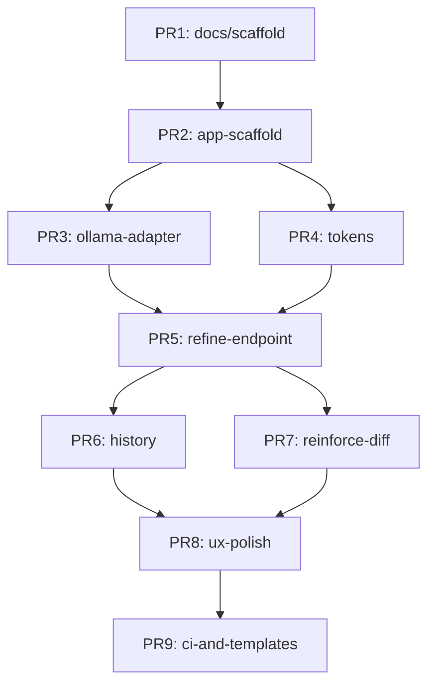

# Work Breakdown Structure

## Epic Overview

The MVP is organized into 4 major epics, delivered across 9 PRs with clear dependencies and parallelization opportunities.

```
Epic 1: Foundation (PRs 1-2)
├── Planning artifacts & Next.js scaffold

Epic 2: Core Backend (PRs 3-5)  
├── Ollama integration
├── Token counting  
└── Refine operation

Epic 3: Advanced Features (PRs 6-7)
├── History management
└── Reinforce + diff operations

Epic 4: Polish & CI (PRs 8-9)
├── UX improvements
└── CI pipeline
```

## Epic 1: Foundation & Scaffold

### Story 1.1: Planning Documentation
**Branch:** `docs/scaffold@claude`  
**Files:** `docs/plan/*`, `docs/devlog/PR-0001.md`, `CHANGELOG.md`

**Tasks:**
- [x] High-level architecture document
- [x] Work breakdown structure  
- [x] PR sequence with DoR/DoD
- [x] Test strategy definition
- [x] Risk assessment and mitigations
- [x] Prompt templates for Refine/Reinforce
- [x] Devlog entry and changelog update

**Acceptance:** All planning artifacts complete, internally consistent, aligned to invariants

### Story 1.2: Next.js Application Scaffold  
**Branch:** `feat/app-scaffold@claude`  
**Files:** `package.json`, `next.config.js`, `tailwind.config.js`, `app/page.tsx`, `app/layout.tsx`, `app/globals.css`

**Tasks:**
- [ ] Initialize Next.js 14+ with App Router
- [ ] Configure TypeScript strict mode  
- [ ] Setup Tailwind CSS with custom theme
- [ ] Create split-pane layout (input left, output right)
- [ ] Add control bar with disabled buttons
- [ ] Basic responsive design
- [ ] Accessibility foundation (semantic HTML, focus rings)

**Acceptance:** App runs at localhost:3000, layout matches mockups, buttons present but non-functional

## Epic 2: Core Backend Integration

### Story 2.1: Ollama Integration
**Branch:** `feat/ollama-adapter@claude`  
**Files:** `lib/ollama.ts`, `app/api/models/route.ts`, `types/ollama.ts`

**Tasks:**
- [ ] Create Ollama client with error handling
- [ ] Implement `listModels()` function
- [ ] Implement `generateText()` function  
- [ ] GET /api/models endpoint (returns model list with gpt-oss:20b default)
- [ ] Model validation and fallback logic
- [ ] Integration tests with local Ollama
- [ ] Error states for Ollama unavailable

**Acceptance:** /api/models returns JSON, model dropdown populates, handles Ollama offline

### Story 2.2: Token Counting System
**Branch:** `feat/tokens@claude`  
**Files:** `lib/tokens/index.ts`, `lib/tokens/tiktoken.ts`, `components/TokenCounter.tsx`

**Tasks:**
- [ ] Abstract token counter interface
- [ ] tiktoken implementation (@dqbd/tiktoken)
- [ ] Token counter React component  
- [ ] Live counting on input/output text areas
- [ ] Performance optimization (debounce)
- [ ] Unit tests for accuracy and performance
- [ ] Pluggable architecture for future tokenizers

**Acceptance:** Real-time token counts display, performance < 100ms, ≥80% test coverage

### Story 2.3: Refine Operation
**Branch:** `feat/refine-endpoint@claude`  
**Files:** `app/api/refine/route.ts`, `lib/prompts.ts`, `types/api.ts`

**Tasks:**
- [ ] POST /api/refine route handler
- [ ] Request validation (Zod schema)
- [ ] Refine prompt template (see 50-prompts.md)
- [ ] Ollama integration for text generation
- [ ] Usage tracking (input/output tokens)
- [ ] Error handling and validation
- [ ] API tests with mock responses

**Acceptance:** Refine operation works end-to-end, returns {output, usage}, validates inputs

## Epic 3: Advanced Features

### Story 3.1: History Management  
**Branch:** `feat/history@claude`  
**Files:** `lib/history.ts`, `hooks/useHistory.ts`, `components/HistoryControls.tsx`

**Tasks:**
- [ ] History stack data structure
- [ ] Push/undo/redo operations
- [ ] localStorage persistence
- [ ] Session hydration on page load
- [ ] History size limits and cleanup
- [ ] React hook for history state
- [ ] Undo/Redo button components
- [ ] Comprehensive unit tests

**Acceptance:** All edits tracked, undo/redo functional, survives page reload, ≥80% test coverage

### Story 3.2: Reinforce Operation & Diffs
**Branch:** `feat/reinforce-diff@claude`  
**Files:** `lib/diff.ts`, `components/DiffViewer.tsx`, `app/api/refine/route.ts` (extend)

**Tasks:**
- [ ] Text diff algorithm (Myers or diff-match-patch)
- [ ] Compact patch format implementation
- [ ] Patch application and reversal
- [ ] Reinforce prompt template
- [ ] Extend /api/refine for reinforce mode
- [ ] Diff preview component
- [ ] Apply/discard patch UI
- [ ] Edge case testing (CRLF, Unicode, empty ranges)

**Acceptance:** Reinforce creates valid patches, diff preview works, apply/undo functional, ≥80% test coverage

## Epic 4: Polish & Infrastructure

### Story 4.1: UX Polish & Accessibility
**Branch:** `feat/ux-polish@claude`  
**Files:** `components/*`, `app/page.tsx`, `hooks/useKeyboardShortcuts.ts`

**Tasks:**
- [ ] Keyboard shortcuts (Ctrl+Z/Y for undo/redo, Ctrl+Enter for refine)
- [ ] Copy button with clipboard API
- [ ] Loading states and spinners
- [ ] Error boundaries and user feedback
- [ ] Focus management and tab order  
- [ ] Screen reader compatibility
- [ ] Responsive design improvements
- [ ] Performance optimizations

**Acceptance:** Fully accessible, keyboard navigable, copy function works, responsive on mobile

### Story 4.2: CI Pipeline & Templates
**Branch:** `chore/ci-and-templates@claude`  
**Files:** `.github/workflows/ci.yml`, `.github/PULL_REQUEST_TEMPLATE.md`, `.github/CODEOWNERS`

**Tasks:**
- [ ] GitHub Actions CI workflow (Node 20, pnpm)
- [ ] TypeScript, ESLint, build, test checks
- [ ] PR template with checklist
- [ ] CODEOWNERS file
- [ ] Coverage reporting setup
- [ ] Branch protection rules
- [ ] Merge queue configuration

**Acceptance:** CI runs on PRs, enforces quality gates, merge queue operational

## Dependencies & Parallelization



**Parallel Development Opportunities:**
- PRs 3-4 can develop in parallel after PR 2
- PRs 6-7 can develop in parallel after PR 5  
- PR 9 can begin early and evolve alongside development

## File Touch Points Summary

```
package.json - PR2 (deps), PR9 (scripts)
app/
  page.tsx - PR2 (scaffold), PR4 (tokens), PR6 (history), PR8 (polish)
  layout.tsx - PR2 (scaffold)
  globals.css - PR2 (styles)
  api/
    models/route.ts - PR3 (ollama)
    refine/route.ts - PR5 (refine), PR7 (reinforce)
lib/
  ollama.ts - PR3
  tokens/ - PR4
  history.ts - PR6  
  diff.ts - PR7
  prompts.ts - PR5, PR7
components/ - PR4 (tokens), PR6 (history), PR7 (diff), PR8 (polish)
.github/ - PR9 (ci)
```

## Estimation Notes

- **Total PRs:** 9
- **Critical path:** PRs 1→2→5→7→8 (planning → scaffold → refine → reinforce → polish)
- **Parallelizable:** PRs 3-4, PRs 6-7 
- **Risk mitigation:** Each PR independently testable and deployable
- **Integration points:** Well-defined API contracts prevent merge conflicts